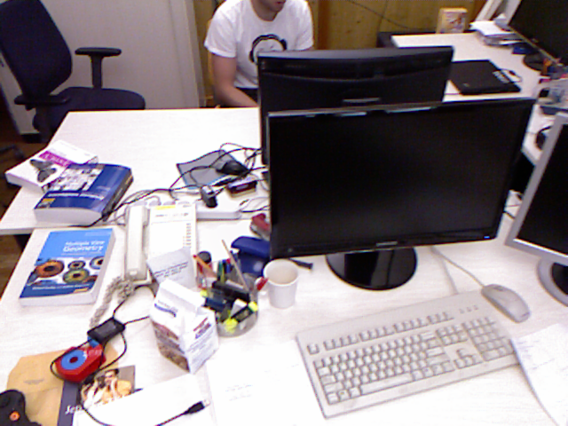
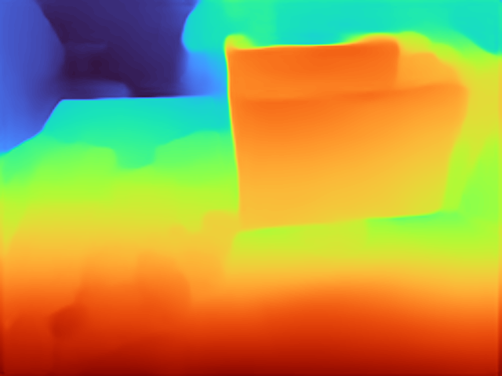
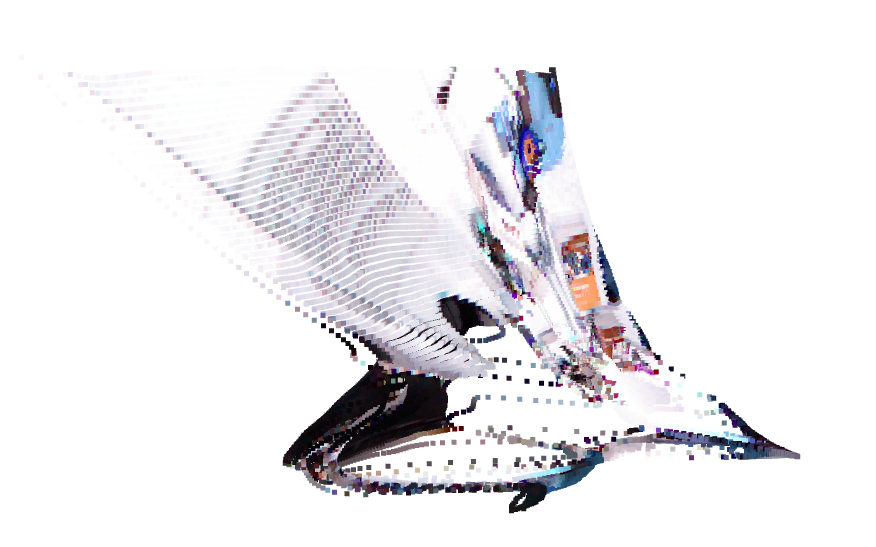

# Atlas Perception

Atlas Perception is a ROS2-compatible robotics perception pipeline that converts camera streams into depth estimates, localization cues, and spatial maps for downstream navigation in simulated environments.

## Features

- Camera ingestion from webcam, video files, or ROS2 image topics
- ROS2 image-topic ingestion through `rclpy` and `cv_bridge`
- Real monocular depth backends for MiDaS or Depth Anything
- Depth + trajectory hooks with future SLAM backend integration
- Explicit SLAM modes for `disabled`, `dummy`, and backend wrappers
- Point cloud generation with NumPy-native storage and Open3D `.ply` export
- ROS2 topic publishing for depth, pose, and colored point cloud outputs
- Config-driven simulator workflows for Isaac Sim and Gazebo

## Pipeline

```text
camera input
   |
   v
depth estimation
   |
   v
point cloud projection
   |
   v
pose / visual odometry
   |
   v
map / cloud fusion
   |
   v
ROS2 topic publishing
```

## Quickstart

```bash
python -m venv .venv
# Windows
.venv\Scripts\activate
# macOS/Linux
source .venv/bin/activate
pip install -r requirements.txt
pip install -e .[dev]
python -m src.main --config configs/default.yaml
python -m src.main --config configs/default.yaml --override-config configs/gazebo_demo.yaml
```

The first run of a Torch Hub backend may download model assets. For more reproducible setups, pin `torch` and backend dependencies in your environment and set `depth.local_weights_path` to a local checkpoint when available.

## Configuration

Primary runtime settings live in `configs/default.yaml`. You can layer an additional YAML file on top with `--override-config`, and nested dictionaries are merged recursively.

Depth outputs are explicit:

- `depth.output_mode: relative_normalized` returns a per-frame normalized relative depth map in `[0, 1]`
- `depth.output_mode: raw` returns the backend's raw depth output without pretending it is metric depth

SLAM modes are explicit:

- `slam.mode: disabled` keeps pose fixed at identity
- `slam.mode: dummy` generates synthetic forward motion for pipeline testing
- `slam.mode: orbslam_wrapper` reserves a backend integration point and currently raises until implemented

Config validation runs before startup and fails early on invalid camera intrinsics, unsupported modes, or missing required sections.

Example:

```bash
python -m src.main --config configs/default.yaml --override-config configs/isaac_demo.yaml
```

## Simulator Runs

Use the simulator-specific configs directly:

```bash
python -m src.main --config configs/default.yaml --override-config configs/isaac_demo.yaml
python -m src.main --config configs/default.yaml --override-config configs/gazebo_demo.yaml
```

If ROS2 `launch` is available, the launch files also wrap those flows:

```bash
ros2 launch launch/atlas_perception.launch.py
ros2 launch launch/sim_demo.launch.py sim_config:=configs/gazebo_demo.yaml
```

## Sample Run Artifacts

Documented outputs for a full run are described in `docs/sample_run.md`. A successful run should produce:

- an RGB input frame capture
- a depth visualization image
- `data/outputs/frame_cloud.ply`
- a screenshot from the point cloud viewer

Current generated demo artifacts:

- [tum_rgb_frame.png](c:/Users/Ivan/atlas-perception/demo/screenshots/tum_rgb_frame.png)
- [tum_depth_map.png](c:/Users/Ivan/atlas-perception/demo/screenshots/tum_depth_map.png)
- [pointcloud_vis.png](c:/Users/Ivan/atlas-perception/demo/screenshots/pointcloud_vis.png)
- [frame_cloud.ply](c:/Users/Ivan/atlas-perception/data/outputs/tum_demo/frame_cloud.ply)

## Demo Visuals

RGB input:



Estimated depth:



Projected point cloud:



Recommended first dataset: TUM RGB-D `fr1/xyz`. The official TUM page recommends the `xyz` series for first experiments, and `fr1/xyz` is the smallest of the suggested starter sequences at about `0.47GB`. Sources: [download page](https://cvg.cit.tum.de/data/datasets/rgbd-dataset/download), [dataset overview](https://cvg.cit.tum.de/data/datasets/rgbd-dataset).

One-frame artifact flow:

```bash
python tools/run_tum_artifact.py --rgb data/samples/tum_freiburg1_xyz/rgb/1305031102.175304.png --out-dir data/outputs/tum_demo
```

## ROS2 Topics

Default topics:

- `/camera/image_raw`
- `/atlas/depth`
- `/atlas/pose`
- `/atlas/pointcloud`

See `docs/ros_topics.md` for the topic contract.

## Development

Install test tooling with:

```bash
pip install -e .[dev]
```

## Project Layout

- `src/io`: camera and stream adapters
- `src/depth`: depth inference and visualization
- `src/slam`: trajectory and odometry interfaces
- `src/mapping`: point cloud projection, fusion, and occupancy utilities
- `src/ros2`: ROS2 nodes, publishers, subscribers, and transforms
- `src/sim`: Isaac Sim and Gazebo bridges plus launch-time topic adaptation
- `docs`: architecture and ROS interface documentation
- `launch`: ROS2 launch entrypoints

## Status

The repository now includes real ROS2 image ingestion, explicit depth and SLAM modes, NumPy-native point cloud accumulation with export adapters, and simulator-aware runtime/launch configuration for Isaac Sim and Gazebo.
