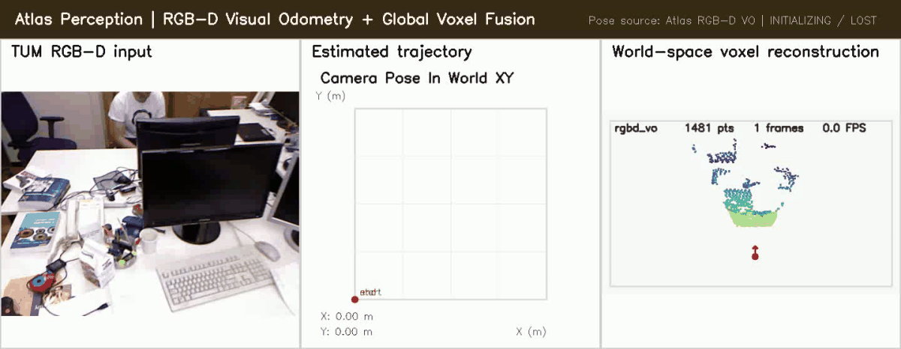
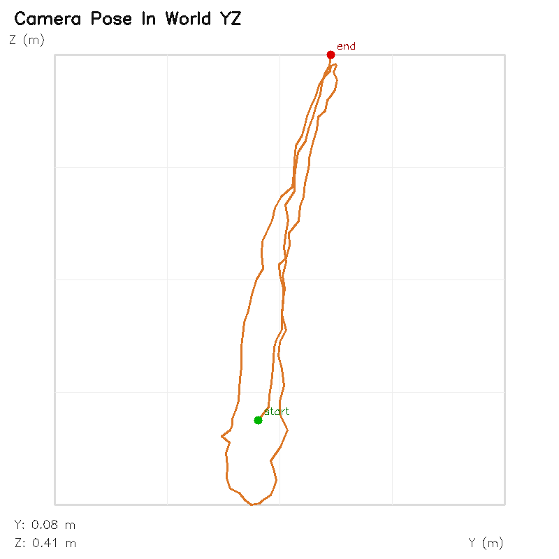
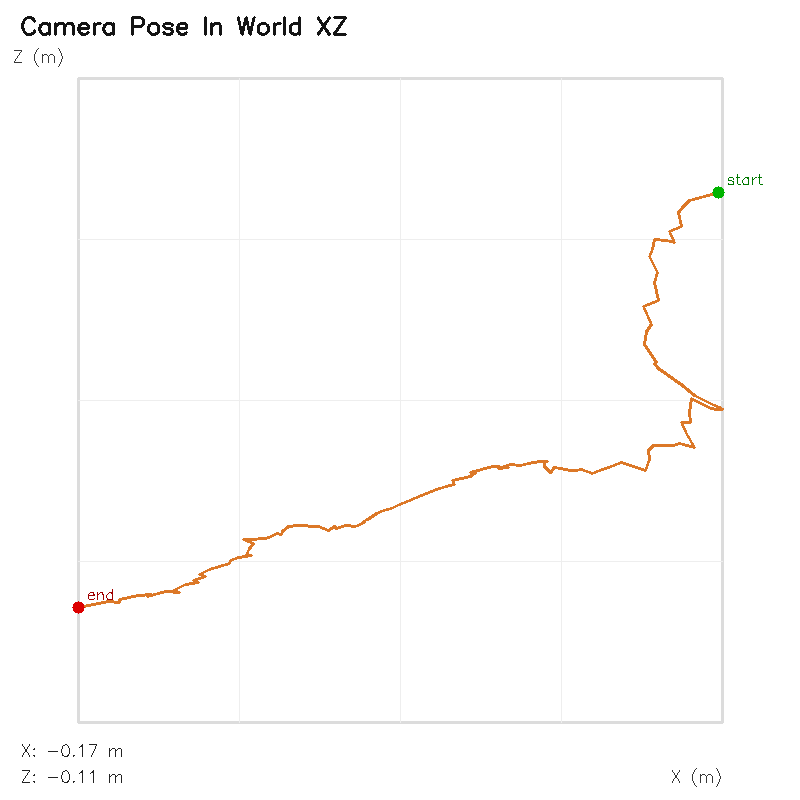
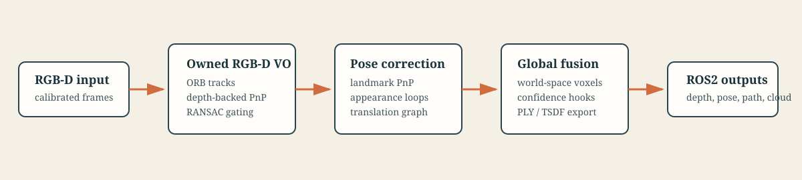

# Atlas Perception

Atlas Perception is a modular RGB-D perception stack for metric visual odometry, pose-aware 3D reconstruction, and ROS2-facing robotics workflows.

It is a research prototype, not production SLAM: the owned frontend provides sparse RGB-D visual odometry, landmark-assisted recovery, and bounded loop-constraint correction; rotation optimization, map reintegration after a loop, and uninstrumented relocalization remain open work.

## Flagship Result



The demo uses real TUM RGB-D input and Atlas's owned `rgbd_vo` pose source. It shows the source RGB frame, estimated trajectory, and world-space voxel reconstruction. No ground-truth pose drives the estimate.

## Quantitative Evidence

Both runs use metric dataset depth and compare the estimated trajectory with TUM ground truth. ATE is rigidly SE(3)-aligned; RPE is computed from consecutive relative motions.

| Sequence | Frames | Tracked poses | ATE RMSE | Translation RPE RMSE | Rotation RPE RMSE |
| --- | ---: | ---: | ---: | ---: | ---: |
| TUM `fr1_xyz` | 120 | 119 | 0.0235 m | 0.0055 m | 0.365 deg |
| TUM `fr2_xyz` | 120 | 119 | 0.0115 m | 0.0027 m | 0.223 deg |

| `fr1_xyz` owned VO | `fr2_xyz` owned VO |
| --- | --- |
|  |  |

The checked-in result bundles include resolved configs, manifests, runtime metrics, trajectories, plots, and evaluation summaries. They do not include the raw datasets or reconstructed clouds.

## Architecture



Core capabilities:

- Metric RGB-D visual odometry: ORB feature tracks, previous-frame depth back-projection, and PnP-RANSAC pose estimation.
- Landmark localization: calibrated ArUco corner observations, PnP, reprojection gating, covariance estimates, and persistent RGB-D VO-state correction.
- Bounded loop handling: ORB appearance candidates, target-depth PnP verification, exported constraint diagnostics, and translation-only graph correction.
- Global reconstruction: persistent world-space voxel fusion, optional confidence and multi-view consistency hooks, colored PLY export, and optional TSDF integration.
- ROS2 interfaces: RGB/CameraInfo ingestion plus depth, pose, path, point-cloud, and visual-pose publications with explicit camera/map frame semantics.

## Quickstart

```bash
python -m venv .venv
.venv\Scripts\activate
pip install -r requirements.txt
pip install -e .[dev]
```

Run the unit suite:

```bash
python -m pytest
black --check src tests tools
ruff check .
```

## Reproduce the VO Baselines

Download the matching TUM RGB-D sequence and place it at the path used by the relevant config. The source can be either the sequence directory itself or its standard nested archive directory.

```bash
python -m src.main --config configs/default.yaml --override-config configs/benchmarks/tum_fr1_xyz_rgbd_vo.yaml --max-frames 120
python tools/evaluate_trajectory.py --estimated-json data/outputs/benchmarks/tum_fr1_xyz_rgbd_vo/trajectory.json --groundtruth-tum rgbd_dataset_freiburg1_xyz/rgbd_dataset_freiburg1_xyz/groundtruth.txt
```

```bash
python -m src.main --config configs/default.yaml --override-config configs/benchmarks/tum_fr2_xyz_rgbd_vo.yaml --max-frames 120
python tools/evaluate_trajectory.py --estimated-json data/outputs/benchmarks/tum_fr2_xyz_rgbd_vo/trajectory.json --groundtruth-tum rgbd_dataset_freiburg2_xyz/rgbd_dataset_freiburg2_xyz/groundtruth.txt
```

Generate the flagship artifact from the first sequence:

```bash
python -m src.main --config configs/default.yaml --override-config configs/benchmarks/tum_fr1_xyz_vo_flagship.yaml --max-frames 60
python tools/export_demo_gif.py --video demo/videos/atlas_rgbd_vo_flagship.mp4 --gif demo/gifs/atlas_rgbd_vo_flagship.gif --fps 8 --max-frames 60 --width 1200
```

## Evaluation and Limits

- `rgbd_vo` requires metric input depth; it rejects relative monocular depth configurations.
- The published VO results cover only the first 120 frames of two TUM `xyz` sequences. They are not long-horizon, dynamic-scene, or real-hardware validation.
- Appearance loop closure has direct synthetic regression coverage but no published real-revisit result yet.
- Current graph correction optimizes translations only. Existing voxel points are not reintegrated after a loop correction.
- Landmark recovery requires a configured, known fiducial map. It is not generic place-recognition relocalization.
- CPU voxel fusion is not real-time in the published 120-frame runs; mapping dominates end-to-end runtime.
- ROS2 message/frame contracts are covered by code and unit tests, but a live ROS2/RTAB-Map/hardware integration study remains future validation.

## Documentation

- [Architecture](docs/architecture.md)
- [Experiments and provenance](docs/experiments.md)
- [ROS2 topics and frame semantics](docs/ros_topics.md)
- [Visual landmark localization](docs/visual_localization.md)
- [Pipeline details](docs/pipeline.md)

## Citation and Data

Atlas does not redistribute TUM RGB-D data. Cite the original TUM dataset publication when using those sequences.
